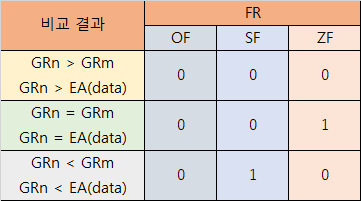

# 레지스터
|줄임말|명칭|일본명칭|비트수|설명|
|--|------------|------------|---|-------------------------------|
|GR|범용 레지스터|汎用レジスタ|16|GR0\~GR7까지 8종류가 존재하며 GR1\~GR7은 지표레지스터로도 사용|
|FR|플래그 레지스터|フラグレジスタ|3|명령을 실행한 후, 넘침과 양・음수의 정보 설정|
|PR|프로그램 레지스터|プログラムレジスタ|16|다음 실행해야하는 명령의 선두주소를 보유
|SP|스택 포인터|スタックポインタ|16|스택 영역의 최상단의 주소를 보유

GRn, GRm - GR0\~GR7\
GRx - GR1\~GR7 GR0은 사용불가\
adr
 - 10진정수 (-32768\~65535)
 - 16진정수 (#0000\~#FFFF)
 - 레이블
 - 리터럴

## FR 플래그 레지스터
|줄임말|명칭|설명|
|-----|----|----|
|ZF|Zero Flag|연산 결과가 0이면 1|
|SF|Sign Flag|연산 결과가 음수이면 1|
|OF|Overflow Flag|부호 있는 숫자간의 연산 결과가 비트 범위를 넘어서면 1|
|CF|Carry Flag|부호 없는 숫자간의 연산 결과가 비트 범위를 넘어서면 1|
|AF|Adjust Flag(Auxiliary Carry Flag)|10진수 계산시 보정이 필요하면 1 이진화 심법에서 사용됨|
|PF|Parity Flag|연산 결과에서 1로된 비트의 수가 짝수개일 경우 1|
|DF|Direction Flag|문자열 조작에서 이 플래그의 값이 0일 경우, 주소 레지스터 값이 자동으로 증가(전진 처리), 1일 경우, 레지스터 값이 자동으로 감소(후진 처리)|
|IF|Interrupt Flag|인터럽트 요구에 있어서 이 값이 0일 경우는 외부에서 들어오는 인터럽트를 무시하고, 1일 경우에는 요구를 받아들임.|
|TF|Trap Flag|이 플래그의 값이 1일경우, 하나의 명령이 실행될 때마다 인터럽트가 발생. 디버깅에 사용됨.|

# 명령어
[ ]는 생략 가능\
・는 위와 동일 혹은 or
|레이블|명령어|오퍼랜드|기능|
|---|------|---------|---------------------|
|레이블|START|[실행 개시 주소]|프로그램의 선두 정의|
||END|GRn, adr[, GRx]|프로그램의 끝을 명시
|[레이블]|DS|n|n개 글자의 영역 확보|
|[레이블]|DC|n|10진정수 정의|
|・|・|#hhhh|16진정수 정의|
|・|・|'문자열'|문자정수 정의|
|・|・|레이블|주소정수 정의|

## 비교문
CPA는 -32768/~-32767의 산술10진수 비교\
CPL은 0\~65535의 논리10진수 비교\

|레이블|명령어|오퍼랜드|기능|
|---|------|---------|---------------------|
|[레이블]|CPA|GRn, GRm|FR ← GRn-GRm의 부호|
|・|・|GRn,adr[, GRx]|FR ← GRn-EA(data)의 부호|
|[레이블]|CPL|GRn, GRm|FR ← GRn-GRm의 부호|
|・|・|GRn,adr[, GRx]|FR ← GRn-EA(data)의 부호|
|[레이블]|JMI|adr[, GRx]|SF=1이라면 PR ← adr+GRX|
|[레이블]|JPL|adr[, GRx]|SF=0이라면 PR ← adr+GRX|
|[레이블]|JNZ|adr[, GRx]|ZF=1이라면 PR ← adr+GRX|
|[레이블]|JZE|adr[, GRx]|ZF=0이라면 PR ← adr+GRX|
|[레이블]|JOV|adr[, GRx]|OF=1이라면 PR ← adr+GRX|
