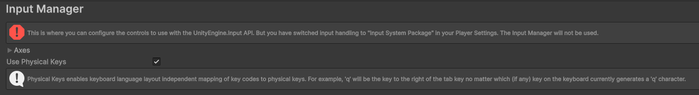
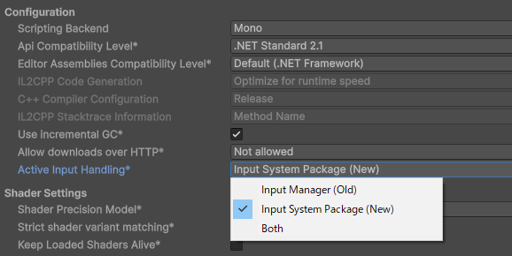
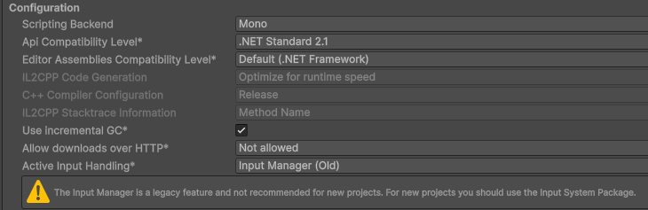

> ## エラー文
 
`InvalidOperationException: You are trying to read Input using the UnityEngine.Input class, but you have switched active Input handling to Input System package in Player Settings.`

> ## エラーの発端
Input Managerの'Horizontal'と'Vertical'を入力としてプレイヤーの動きを制御したら上記のエラーが発生した。 

> ## 開発環境
- Unity Version : 6000.2.12f1

> ## エラーの内容
プロジェクトを新規作成すると、デフォルトではInput SystemがInput Managerとして設定されていることが確認できた。
この件について確認しべき箇所は次のとおりである。
- Input Manager : `[Edit] - [Project Settings] - [Input Manager]` 
 
注意によると、プレイヤー設定で入力設定が 'Input System Package' になっていることが分かる。

- Active Input Handling\* : `[Edit] - [Project Settings] - [Player] - [Other Setting] - [Configuration] - [Active Input Handling*]` 
 
デフォルト設定では Active Input Handling\* が Input System Package になっていることが分かる。

> ## エラーの解決
Input Managerの機能を使用したいが、Active Input HandlingにInput Managerが設定されておらず発生する問題である。 
Active Input Handlingの設定をInput System Package(New)からInput Manager(Old)若しくはBothに変更すれば解決できる。 
